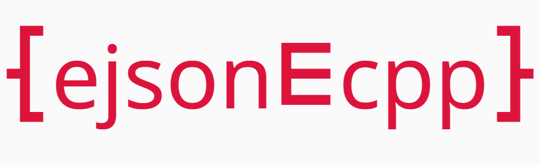

[简中](./doc/README_zh.md) | English

<!-- TOC -->
  * [New Features(C++17 or above)](#new-features--c17-or-above-)
  * [Quick Start](#quick-start)
    * [Requirements](#requirements)
    * [Installation and introduction](#installation-and-introduction)
    * [Getting Started](#getting-started)
  * [Common Uses](#common-uses)
  * [API Introduction](#api-introduction)
    * [API identification by naming style](#api-identification-by-naming-style)
    * [Macro Definitions](#macro-definitions)
      * [FROM_JSON_FUNC&FROM_JSON_FRIEND_FUNC](#fromjsonfuncfromjsonfriendfunc)
      * [TO_JSON_FUNC&TO_JSON_FRIEND_FUNC](#tojsonfunctojsonfriendfunc)
      * [AUTO_GEN_NON_INTRUSIVE&AUTO_GEN_INTRUSIVE](#autogennonintrusiveautogenintrusive)
      * [ENABLE_JSON_COUT](#enablejsoncout)
    * [FromJSON series functions](#fromjson-series-functions)
      * [Parameter Description](#parameter-description)
      * [Usage examples](#usage-examples)
    * [ToJSON series functions](#tojson-series-functions)
      * [Parameter Description](#parameter-description-1)
      * [Example of using](#example-of-using)
    * [JObject series functions](#jobject-series-functions)
      * [Constructor for JObject](#constructor-for-jobject)
        * [kDict](#kdict)
        * [kList](#klist)
        * [to_string](#tostring)
        * [Static methods](#static-methods)
  * [Notes](#notes)
<!-- TOC -->



---
[](https://github.com/ACking-you/ejson4cpp/blob/master/LICENSE)
[](https://img.shields.io/badge/Platform-Cross--platformable-blue)
[](https://en.cppreference.com/w/cpp/compiler_support/11)

`ejosn4cpp`: means that this is a very `easy` to use and very `efficiency` c++ json parsing library. It supports c++11 and above, and is fully cross-platform.

* The use of `easy` is reflected in:
    1. api is simple, you only need to focus on two functions, and support for one-click json structure interchange.
    2. easy to introduce, support cmake command one click to introduce the project and use. 3.
    3. error locating is simple, whether parsing json or serializing to json, any wrong operation will have detailed error reporting information (simulated printed stack information), making error locating simpler.

* Performance `efficiency` is reflected in:

  The native benchmark (3000 lines of json) results are shown in the figure.
  
    1. the performance of deserialization (**Parse**) is significantly better than `nlohmann-json` and `jsoncpp`, but only half the performance of `rapidjson`.
    2. serialization (**Stringify**) is an order of magnitude ahead of all other json libraries.
    3. find(**FindMember**): Since I have seen the source code of `rapidjson`, I found that the nodes of each element are organized in the form of an array, and no other advanced data structures are used, so I specifically tested him to find members, and found that the performance is indeed `O(n)` level.

  The code repository of benchmark: [https://github.com/ACking-you/bench_json4cpp](https://github.com/ACking-you/bench_json4cpp)

## New Features(C++17 or above)
* Since v1.5.2 support from macro to define a method tag to control the behavior of json parsing.

Example:
```cpp
struct student
{
   int         id{};
   double      score{};
   std::string name;
   ALIAS_EJSON(id,studentNo) //Take an alias
   OPTION_EJSON(name,"null") //Allows the value to not exist when parsed and assigned the value you specify if it does not exist

   AUTO_GEN_INTRUSIVE(student,id,score,name) //Register the corresponding fields for JSON parsing
};
```
This feature also supports non-intrusive version.
```cpp
struct student
{
   int         id{};
   double      score{};
   std::string name;
   ALIAS_EJSON(id,studentNo) //Take an alias
   OPTION_EJSON(name,"null") //Allows the value to not exist when parsed and assigned the value you specify if it does not exist
};
AUTO_GEN_NON_INTRUSIVE(student,id,score,name) //Register the corresponding fields for JSON parsing
```
> Note that macros such as `ALIAS_EJSON` can only be used inside the class, and you must ensure that the macro code for the registration field follows these macros.

If you encounter a field in the struct that cannot be directly supported (such as `enum`), you can customize the parsing process of the corresponding field through the `CUSTOM_EJSON` macro.

Example:
```cpp
enum class Type { kStudent, kTeacher };

// A custom parsing process is implemented to strongly convert enumeration types to supported integer types
void custom_solve(ejson::JObject* j, void* v, ejson::EJsonAction action)
{
   switch (action)
   {
      case ejson::EJsonAction::kToJson: j->at("type").get_from(*(int*)v); break;
      case ejson::EJsonAction::kFromJson: j->at("type").get_to(*(int*)v); break;
   }
}

struct people
{
   Type        type{Type::kStudent};
   int         id{};
   double      score{};
   std::string name;
   ALIAS_EJSON(id, studentNo)       // Take an alias
   CUSTOM_EJSON(type, custom_solve) // Customize the parsing process
   OPTION_EJSON(name, "null")       // Allows the value to not exist when parsed and assigned the value you specify if it does not exist
};
AUTO_GEN_NON_INTRUSIVE(people, type, id, score,name)   // Register the corresponding fields for JSON parsing
```
> Please note that the second parameter of the `CUSTOM_EJSON` macro needs to be a function pointer with the corresponding function signature `void(JObject,void,EJsonAction)`, you can write a lambda expression directly, or you can directly separate a function.

## Quick Start

### Requirements

* C++11 or above, which is cross-platform

### Installation and introduction

The following two methods are recommended for introduction.

* Method 1: Introduce via the `FetchContent` module in cmake

    1. add the following code to the project cmake to introduce, domestic if the network problems can not use this gitee image source: https://gitee.com/acking-you/ejson4cpp.git

       ```cmake
       include(FetchContent)
       
       FetchContent_Declare(
               ejson4cpp
               GIT_REPOSITORY https://github.com/ACking-you/ejson4cpp.git
               GIT_TAG origin/master
               GIT_SHALLOW TRUE)
       FetchContent_MakeAvailable(ejson4cpp)
       ````

    2. Link `ejson` in the target that needs to use the library.

       ```cmake
       target_link_libraries(target ejson)
       ```

* Method 2: Download the package manually and introduce it via cmake command

    1. download the project source code via the git command

       ```shell
       git clone https://github.com/ACking-you/ejson4cpp.git
       ````
    2. Add the project to a subproject.

       ```cmake
       add_subdirectory(ejson4cpp)
       ```
    3. Link ``ejson`` in the target that needs to use the library.

       ```cmake
       target_link_libraries(target ejson)
       ```

### Getting Started

Here's an example of parsing json's configuration file mapping to C++ structs.

Assuming there are redis, mysql, and logging services that need to be configured via configuration files, we start by writing the structure as follows.

```cpp
struct server
{
   int port{};
   std::string host;
};

struct log
{
   std::string level;
   std::string filedir;
   std::string formatter;
};

struct config
{
   log logger;
   server redis;
   server mysql;
};
```

A simulated json configuration file is as follows.

```json
{
"logger": {
  "filedir": "home/project/1",
  "formatter": "default",
  "level": "debug"
},
"mysql": {
  "host": "192.31.1.1",
  "port": 1314
},
"redis": {
  "host": "127.0.0.1",
  "port": 1444
}
}
```

The function to be implemented now is to read the data from the json configuration file to initialize the config structure, which we can do by following these steps.

See [example/example1.cc](https://github.com/ACking-you/ejson4cpp/blob/master/example/example1.cc) for the complete code

1. Make the custom types server, log, and config support json serialization by adding the following macro definition.

   ```cpp
   // auto generate log/server/config to_json and from_json
   AUTO_GEN_NON_INTRUSIVE(log, level, filedir, formatter)
   AUTO_GEN_NON_INTRUSIVE(server, host, port)
   AUTO_GEN_NON_INTRUSIVE(config, logger, redis, mysql)
   ```

2. Define the config variable and call the ``FromFile`` function to complete the requirement.

   ```cpp
   struct config s_config;
   // init config from config.json
   Parser::FromFile(CONFIG_PATH, s_config);
   ```

   If you need to rewrite back to the file, you can call the `ToFile` function:

   ```cpp
   // write config to file
   Parser::ToFile(CONFIG_PATH, s_config);
   ```

   If you read the data from a json string and initialize the corresponding variables (deserialization) you can call the ``FromJSON`` function: 

   ```cpp
   // init config struct from json string
   Parser::FromJSON(j, s_config);
   ```

   If you need to convert variables to json strings (serialization), you can call the ``ToJSON`` function:

   ```cpp
   auto json_str = Parser::ToJSON(s_config);
   ```


Well, after the above two steps, you have learned the core usage of the whole library, and yes, this library promotes the use of direct functions instead of classes to achieve the corresponding functions, which will reduce your memory and thinking process. Of course, if you need to use it in more detail, you can learn about the usage of the `JObject` class, which is written in great detail in the [API introduction](#api-introduction).

## Common Uses

In the process of back-end development, the data coming from the front-end is often `json` data, so let's use this library to simulate a simple back-end business.

For example, in the comment section of a video platform, the first thing that comes to mind is a comment, and then the user who sent it.

Then we can abstract out the `comment` and `user_info` structures that represent the messages that need to be displayed on the front end, and then it looks like the following structures on our C++ back end.

The full code is in [example/example2.cc](https://github.com/ACking-you/ejson4cpp/blob/master/example/example2.cc)

```cpp
struct user_info
{
   bool is_follow{};//whether to follow
   int64_t id{};//id information
   int64_t follow_count{};//number of bloggers to follow
   int64_t follower_count{};//number of followers
   std::string name;//username
};

struct comment
{
   int64_t id{};//id information
   int64_t user_id{};//user id information
   std::string created_date;//create time
   std::string content;//comment content
};
```

Then our backend logic might go through the following process.

1. get the json data from the front end (there is usually a forensic process in between)
2. receive the json data and initialize it to the corresponding C++ structure. 3.
3. the business logic processing of the interface call.
4. save the data to the database.

So let's simulate the above process:

1. the front-end data.

   ```cpp
   const char* comment_json = "{\n"
       " \"content\": \"This is a \\\\\\"test\\\\"comment\\",\n"
       " \"created_date\": \"2023-01-16\",\n"
       " \"id\": 1,\n"
       " \"user_id\": 10\n"
       "}";
   const char* user_info_json = "{\n"
       " \"follow_count\": 12,\n"
       " \"follower_count\": 23,\n"
       " \"id\": 1,\n"
       " \"is_follow\": false,\n"
       " \"name\": \"someone's name\"\n"
       "}";
   ```

2. Converting data to C++ structs.
   You need to add the following macro first to make the corresponding structure support json interconversion.

   ```cpp
   AUTO_GEN_NON_INTRUSIVE(user_info, is_follow, id, follow_count, follower_count,name)
   AUTO_GEN_NON_INTRUSIVE(comment, id, user_id, created_date, content)
   ```

   Then call the corresponding function to convert.

   ```cpp
   comment cmt;
   user_info uinfo;
   Parser::FromJSON(comment_json, cmt);
   Parser::FromJSON(user_info_json, uinfo);
   ```

3. handle the business logic, this is skipped.

4. Save data to database, this simulates saving data to file.
   We can create a ``JObject`` of type ``dict_t``, then put the structure we just put in as a ``key-value`` pair, and finally call the ``ToFile`` function.

   ```cpp
   // 4. save data to database (we simulate it to local file)
   auto object = JObject::Dict();
   object.at("comment").get_from(cmt);
   object.at("user_info").get_from(uinfo);
   ejson::Parser::ToFile(DATA_PATH, object);
   ```

   The following json data is eventually obtained to the file.

   ```json
   {
     "comment": {
       "content": "This is a \"test\"comment",
       "created_date": "2023-01-16",
       "id": 1,
       "user_id": 10
     },
     "user_info": {
       "follow_count": 12,
       "follower_count": 23,
       "id": 1,
       "is_follow": false,
       "name": "someone's name"
     }
   }
   ```

## API Introduction

You can view the description of all class members by clicking on `doc/html/index.html`. If you need the documentation in other languages, you can generate it yourself via `Doxygen`.

### API identification by naming style

1. All static member functions exposed to the public are named in `PascalCase` style. As follows.

   ```cpp
   namespace ejson {
   class Parser
   {
      static JObject FromJSON(const str_t &content,bool skip_comment=false);
       
      template <class T>
      static void FromJSON(string_view const &src, T &dst,bool skip_comment=false);
       
      static JObject FromFile(string_view const &filename,bool skip_comment=false);
       
      template <class T>
      static void FromFile(string_view const &filename, T &dst);
      
      template <class T>
      static std::string ToJSON(T &&src,const int indent = -1,
                           const char indent_char = ' ', bool is_esc = false);
       
      template <class T>
      static void ToFile(string_view const &filename, T const &src, 
                         const int indent = -1, const char indent_char = ' ',
                         bool is_esc = false);
       
      static void ToFile(string_view const &filename, JObject const &src,
                        const int indent = -1, const char indent_char = ' ',
                         bool is_esc = false)
   };
   
   class JObject
   {
      static auto Dict() -> JObject;
      static auto List() -> JObject;
   };
   }   // namespace ejson
   ```

2. All ordinary member functions that you want to expose are named in the `snack_case` style, as follows.

   ```cpp
   namespace ejson {
   class JObject
   {
      auto type() const -> Type;
       
      auto at(const str_t &key) const -> ObjectRef;
       
      auto to_string(int indent = -1, char indent_char = ' ',
                                     bool is_esc = false) const -> string;
       
      void push_back(JObject item);
       
      void pop_back();
       
      auto has_key(const str_t &key) const -> bool;
   
      template <class T>
      auto cast() const -> T;
   };
   
   struct ObjectRef
   {
      template <class T>
      auto get_from(T const &src) -> ObjectRef &;
      template <class T>
      void get_to(T &src);
   };
   }   // namespace ejson
   ```

3. There are two remaining functions, as follows.
   ```cpp
   namespace ejson_literals {

   auto operator""_json(const char *json, size_t len) -> JObject;

   auto float_d(int d) -> int;

   }   // namespace ejson_literals
   ```

### Macro Definitions

Macro definitions make it easy and fast for custom types to support the `FromJSON` and `ToJSON` family of functions.

In fact, custom types only need to define the corresponding `from_json` function when using `FromJSON` and the corresponding `to_json` function when using `ToJSON`.

The following are the function signatures for from_json and to_json.

```cpp
void from_json(const ejson::JObject& ejson_j, T& ejson_t);

void to_json(ejson::JObject& ejson_j, const T& ejson_t);
```

You can implement the above two functions yourself to make custom types support ``FromJSON`` and ``ToJSON`` functions like the following.

```cpp
struct student
int
   int id;
   int score;
   std::string name;
};

void to_json(ejson::JObject& ejson_j, const student& ejson_t)
{
   ejson_j.at("id").get_from(ejson_t.id);
   ejson_j.at("score").get_from(ejson_t.score);
   ejson_j.at("name").get_from(ejson_t.name);
}

void from_json(const ejson::JObject& ejson_j, student& ejson_t)
{
   ejson_j.at("id").get_to(ejson_t.id);
   ejson_j.at("score").get_to(ejson_t.score);
   ejson_j.at("name").get_to(ejson_t.name);
}
```

If the attribute is `private`, then it can be defined intrusively like the following.

```cpp
struct student
{
   friend void to_json(ejson::JObject& ejson_j, const student& ejson_t)
   {
      ejson_j.at("id").get_from(ejson_t.id);
      ejson_j.at("score").get_from(ejson_t.score);
      ejson_j.at("name").get_from(ejson_t.name);
   }
private:
   int id;
   int score;
   std::string name;
};
```


#### FROM_JSON_FUNC&FROM_JSON_FRIEND_FUNC

Used to simplify the writing of the `from_json` function definition, for example, the `from_json` function for the `strudent` type can be written as follows

```cpp
struct student
{
   int id;
   int score;
   std::string name;
};
//non-intrusive
FROM_JSON_FUNC(student, ejson_j, ejson_t) {
   ejson_j.at("id").get_to(ejson_t.id);
   ejson_j.at("score").get_to(ejson_t.score);
   ejson_j.at("name").get_to(ejson_t.name);
}

struct student
{
    //intrusive
   FROM_JSON_FRIEND_FUNC(student,ejson_j,ejson_t)
   {
      ejson_j.at("id").get_to(ejson_t.id);
      ejson_j.at("score").get_to(ejson_t.score);
      ejson_j.at("name").get_to(ejson_t.name);
   }
private:
   int id;
   int score;
   std::string name;
};
```

#### TO_JSON_FUNC&TO_JSON_FRIEND_FUNC

Used to simplify the writing of `to_json` function definitions, for example the previous `to_json` function for the `strudent` type could be written like this

```cpp
struct student
{
   int id;
   int score;
   std::string name;
};
//non-intrusive
TO_JSON_FUNC(student, ejson_j, ejson_t) {
   ejson_j.at("id").get_from(ejson_t.id);
   ejson_j.at("score").get_from(ejson_t.score);
   ejson_j.at("name").get_from(ejson_t.name);
}

struct student
{
    //intrusive
   TO_JSON_FRIEND_FUNC(student,ejson_j,ejson_t)
   {
      ejson_j.at("id").get_from(ejson_t.id);
      ejson_j.at("score").get_from(ejson_t.score);
      ejson_j.at("name").get_from(ejson_t.name);
   }
private:
   int id;
   int score;
   std::string name;
};
```

#### AUTO_GEN_NON_INTRUSIVE&AUTO_GEN_INTRUSIVE

These two macros will help you generate the `to_json` and `from_json` functions from the previous example with one click.

The preceding code can be replaced with

```cpp
struct student
{
   int id;
   int score;
   std::string name;
};
//non-intrusive
AUTO_GEN_NON_INTRUSIVE(student,id,score,name)
    
struct student
{
//intrusive
AUTO_GEN_INTRUSIVE(student,id,score,name)
    
private:
   int id;
   int score;
   std::string name;
};
```

#### ENABLE_JSON_COUT

Automatically generates an overload of the `operator<<(ostream&,T)` operator for the corresponding type to support `cout` printing of the corresponding type in json format. This macro can be generated for multiple types.

```cpp
struct student
{
   int id;
   int score;
   std::string name;
};

struct info
int
   int id;
   std::string msg;
};
// make the corresponding type support json formatting
AUTO_GEN_NON_INTRUSIVE(student,id,score,name)
AUTO_GEN_NON_INTRUSIVE(info,id,msg)
    
//support json format cout printing
ENABLE_JSON_COUT(student,info)
```

### FromJSON series functions

#### Parameter Description

```cpp
static JObject Parser::FromJSON(const str_t &content, bool skip_comment = false);
```

Deserialize to a JObject structure based on the json string content.

Parameter description:
* ``content``: the json resource to be parsed, this is a string_view type parameter that supports C-style strings and ``std::string``.
* `skip_comment`: if or not skip comment support is required, default is false, not enabled.

Return values:

* Returns the finished parsed JObject type.

---

```cpp
template <class T>
static void Parser::FromJSON(string_view const &src, T &dst,bool skip_comment = false)
```

Deserialize data to `dst` based on json string content.

Parameter description:

* ``src``: the json resource to be parsed, this is a parameter of type string_view, supporting C-style strings and ``std::string``.
* `dst`: variable to be initialized, can be a custom type.
* `skip_comment`: whether skip comment support is required, default is false, not enabled.

---

```cpp
static JObject& Parser::FromFile(string_view const &filename, bool skip_comment = false);
```

Get the JObject& based on the json data in the file. this JObject is a thread_local variable, which means that each thread shares a JObject. so please note that when you call this function, the value of this shared JObject will be updated.

Parameter descriptions:

* `filename` : The path to the json file.
* `skip_comment` : If or not skip comment support is needed, default is false, not enabled.

Return value:

* The JObject shared by the same thread.

---

```cpp
static void Parser::FromFile(string_view const &filename, T &dst,bool skip_comment = false);
```

Set the value of `dst` based on the json data in the file.

Parameter description.

* `filename` : path to the json file.
* `dst` : The variable to be initialized.
* `skip_comment` : Whether to support skipping comments, default is false, not enabled.

#### Usage examples

```cpp
#include <ejson/parser.h>
#include <iostream>
using namespace ejson;

struct Score
{
   double p;
};

struct student
struct student {
   int id{};
   std::string name;
   score score{};
};
//Automatic generation of to_json and from_json functions for Score types
AUTO_GEN_NON_INTRUSIVE(Score, p)
//automatic generation of to_json and from_json functions for student types
AUTO_GEN_NON_INTRUSIVE(student, id, name, score)
//overload for cout to print data
ENABLE_JSON_COUT(score,student)
int main(){
	const char *json1 =
     R"({"id":324, "name": "Liuxx", "score":{"p":2342343243242.124}})";
    student stu;
    //initialize stu variable using FromJSON
   	Parser::FromJSON(json1,stu);
    //initialize the stu variable using FromFile
    Parser::FromFile("json file path",stu);
    std::cout<<stu;
}
```
### ToJSON series functions

#### Parameter Description

```cpp
template <class T>
static auto Parser::ToJSON(T &&src,const int indent = -1,
                        const char indent_char = ' ', bool is_esc = false) -> std::string;
```

Return any type serialized as a json string.

Parameter description:

* ``src`` : The data to be serialized as a json string.
* `indent` : Whether to beautify the json output, less than 0 means beautify, the rest of the case is the indentation length when beautifying, the default is not beautify.
* `indent_char` : The character to fill in the indent when beautifying, default is `' '`.
* `is_esc` : if or not the escape character should be recognized, default is not recognized.

Return value:

* json string.

---

```cpp
template <class T>
static void ToFile(string_view const &filename, T const &src,
                   const int indent = -1, const char indent_char = ' ',
                      bool is_esc = false);
```

Serialize to json data to a file based on the data in `src`.

Parameter description:

* `filename` : The path of the file to be written.
* `src` : The variable to be serialized.
* `indent` : Whether to beautify the json output, less than 0 means beautify, the rest is the indent length when beautifying, default is not beautify.
* `indent_char` : The character to fill in the indent when beautifying, default is `' '`.
* `is_esc` : whether to recognize the escaped character, default is not recognized.

---


```cpp
static void ToFile(string_view const &filename, JObject const &src
                   const int indent = -1, const char indent_char = ' ',
                      bool is_esc = false)
```

Writes the data in JObject to a file as json.

Parameter description:

* `filename` : The path of the file to be written.
* `src` : JObject variable.
* `indent` : Whether to beautify the json output, less than 0 means beautify, the rest is the indent length when beautifying, default is not beautify.
* `indent_char` : The character to fill in the indent when beautifying, default is `' '`.
* `is_esc` : whether to recognize the escaped characters, default is not recognized.

#### Example of using 

```cpp
#include <ejson/parser.h>
#include <iostream>
using namespace ejson;

struct Score
{
   double p;
};

struct student
struct student {
   int id{};
   std::string name;
   score score{};
};
//Automatic generation of to_json and from_json functions for Score types
AUTO_GEN_NON_INTRUSIVE(Score, p)
//automatic generation of to_json and from_json functions for student types
AUTO_GEN_NON_INTRUSIVE(student, id, name, score)
//overload for cout to print data
ENABLE_JSON_COUT(score,student)
int main(){
    student stu;
    stu.id = 324;
    stu.name = "Liuxx";
    stu.score.p = 2342343243242.124;
    // use ToJSON for serialization
   	auto json_data = Parser::ToJSON(stu);
    //use ToFile to serialize data to a file
    Parser::ToFile("file path",stu);
    std::cout<<stu;
}
```
### JObject series functions

#### Constructor for JObject

Only the following points need to be clear.

1. JObject has a parameterless constructor, but the JObject produced by the parameterless constructor is of null type and cannot be used properly.
2. JObject's constructor can accept most types directly, including custom types and some stl containers. 3.
3. JObject itself does not support copy constructs, only move constructs.

The preceding ToJSON API can be completely replaced by the following, since all serialization processes are actually performed by constructing JObjects.

```cpp
#include <ejson/parser.h>
#include <iostream>
using namespace ejson;

struct Score
{
   double p;
};

struct student
struct student {
   int id{};
   std::string name;
   score score{};
};
//Automatic generation of to_json and from_json functions for Score types
AUTO_GEN_NON_INTRUSIVE(Score, p)
//automatic generation of to_json and from_json functions for student types
AUTO_GEN_NON_INTRUSIVE(student, id, name, score)
//overload for cout to print data
ENABLE_JSON_COUT(score,student)
int main(){
    student stu;
    stu.id = 324;
    stu.name = "Liuxx";
    stu.score.p = 2342343243242.124;
    // construct JObject and use its member functions
   	auto json_data = JObject(stu).to_string();
    std::cout<<stu;
}
```

Member functions of #### JObject

```cpp
Type JObject::type() const
```

Returns the type of the current JObject object, with the following specific types.

* ``kNull`` : the value is of type null
* `kBool` : the value is of type bool
* `kInt` : the value is of type integer
* `kDouble` : value is of type floating point
* `kStr`: value is of type string
* `kList`: value is a list type
* `kDict`: value is a dictionary type (or called an object type)

---

##### kDict

When your JObject is of type `kDict`, the following member functions are available.

```cpp
bool JObject::has_key(const str_t& key) const
```

* Determines if a mapping containing `key` exists in `JObject`.

```cpp
ObjectRef JObject::at(const str_t& key) const
```

* Retrieves the value of the corresponding mapping based on the key, and the value is provided as an ObjectRef type.

  And the ObjectRef type has these two key member functions.

  ```cpp
  ObjectRef& JObject::ObjectRef::get_from(T&& src)
  ```
  Get data from `src` to populate `JObject`, if `src` is a custom type you need to customize the `to_json` method.
  ```cpp
  ObjectRef& JObject::ObjectRef::get_from(T& dst)
  ```
  Get data from `JObject` to populate `dst`, if `dst` is a custom type you need to customize the `from_json` method.

---

##### kList

When JObject is of type `kList`, the following member functions are available.

```cpp
void JObject::push_back(JObject item);
```

* Inserts a value to the end of a `JObject` list. Any type can be inserted, but all need to be explicitly converted to a `JObject` type, such as `JObject(324234)`.

```cpp
void JObject::pop_back()
```

* Delete the value at the end of the list.

---
##### to_string

```cpp
string JObject::to_string(
int indent = -1,
char indent_char = ' ',
bool is_esc = false 
) const
```

Serialization of the final API call to serialize a JObject into a json string to return.

Parameter description.

* ``indent``: used to determine if the json parsing needs to be beautified, if so, the value is the length of the indent. If the value is less than 0, then the value is the length of indentation. The default value is -1.
* `indent_char`: the character to fill in the indent, default is `' '`.
* `is_esc`: if or not the escaped characters need to be handled, default is not on.

Return value.

* Serialize the backend json string.

---

##### Static methods

To facilitate quick creation of `JObject`s of type `dict_t` and `list_t`, the following static functions are defined.

---

```cpp
static JObject JObject::Dict()
```

is used as follows.

```cpp
#include <ejson/parser.h>
#include <iostream>
using namespace ejson;

int main(){
    // construct JObject and use its member functions
   	auto json = JObject::Dict();
    json.at("a").get_from("bc");
    json.at("d").get_from("ef");
    std::cout<<json.to_string();
}
```

---

```cpp
static JObject JObject::List()
```

Use the following.

```cpp
#include <ejson/parser.h>
#include <iostream>
#include <vector>
using namespace ejson;
struct custom_type{
    int id;
    std::vector<int> data;
};

//Automatic generation of to_json and from_json functions
AUTO_GEN_NON_INTRUSIVE(custom_type, id,data)

int main(){
    // construct JObject and use its member functions
   	auto json = JObject::List();
    json.push_back(JObject("abc"));
    custom_type v{1,{2,3,3}};
   	json.push_back(JObject(v));
    std::cout<<json.to_string();
}
```


## Notes

When using this library, you need to pay attention to several points.

1. this library does not validate the character encoding you use, join you use gbk encoding json data for parsing to get or gbk encoding, so this point needs to be noted, it is recommended that all use utrf8 encoding.
2. This library only supports escaping `\` and `"`, other functions such as `\u`, `\b`, etc. are not supported for the time being, I still recommend not storing binary files in json data, if you need to store binary files, subsequent versions may add support for base64 encoding.
3. The process of parsing all strings into `JObject` is a shallow copy (only the pointer is copied), so if you need to use the native `JObject` for data storage, you need to pay extra attention to the memory ownership and life cycle. In most cases direct use of functions is the best choice, and a deep-copy `JObject` structure may follow to make it suitable for storage.
4. All errors in this library are thrown as exceptions, the advantage is that you can simulate the stack information of the recursive call stack for printing, the disadvantage is of course to write `try catch`.